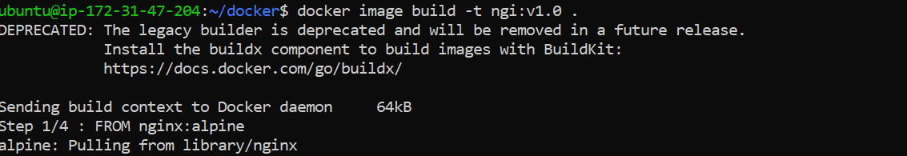
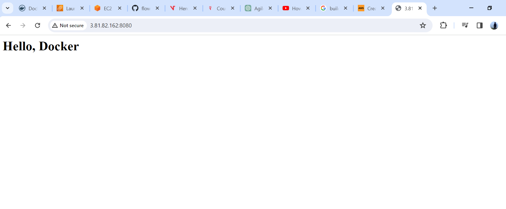
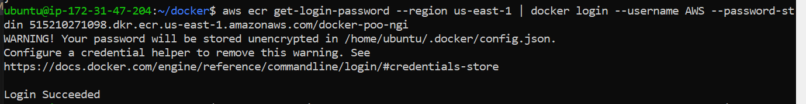

# docker - demo
Objective:

The objective of this assignment is to familiarize yourself with Docker and containerization by Dockerizing a simple HTML page using Nginx as the web server.

Requirements:

1. Basic HTML Page:

   - Create a plain HTML page named `index.html` with some content (e.g., "Hello, Docker!").

2. Nginx Configuration:

   - Create an Nginx configuration file named `nginx.conf` that serves the `index.html` page.

   - Configure Nginx to listen on port 80.

3. Dockerfile:

   - Create a `Dockerfile` to define the Docker image.

   - Use an official Nginx base image.

   - Copy the `index.html` and `nginx.conf` files into the appropriate location in the container.

   - Ensure that the Nginx server is started when the container is run.

4. Building the Docker Image:

   - Build the Docker image using the `Dockerfile`.

5. Push the image on ECR

  - Make the public repository and push them on the ECR

6. Documentation:

   - Provide a brief documentation (in a README.md file) explaining the purpose of each file (index.html, nginx.conf, Dockerfile) and the steps to build and run the Docker container.

-------------------------------------------------------------------------------------
Solution:

* Simple HTML file and docker file with nginx configuration was created and uploaded in Githib repository.
* Created a IAM role with ECR full access.
* Launch EC2 instance with ubuntu OS, Key pair, Securoty group with allows port 8080, added IAM role into the EC2 instance.
* clone the repository to the instance,
* Install docker into EC2 instance with following commands. 
```
sudo apt-get update
sudo apt-get install docker.io -y
```
start docker 
```
sudo systemctl start docker
```
Test docker installation 
```
sudo docker run hello-world
```
 enable docker if its not
 ```
sudo systemctl enable docker
```
Add the ec2-user (ubuntu) to the docker group so that you can run Docker commands without using sudo.
```
sudo usermod -a -G docker ubuntu
```
restart the service
Verify that the ec2-user can run Docker commands without using sudo.
```
docker ps
```
# Docker build and run 
* Build docker image go to the respective folder where dockerfile is located and execute the command mentioned below
```
docker image build -t <image>
```

* Run the docker container 
```
docker run -d --name <name> -p <Host port>:<Container port> <image>
```

* Next navigate to the browser to see the outcome
```
http://local_host:80
```


# Save container data to AWS Elastic Container Registry (ECR)

To send our container data to ECR, we have to create a repository 
```
aws ecr create-repository --repository-name <name> --region <region>
```


We’ll confirm it has been created by navigating to the Amazon Elastic Container Repository in the AWS console


TO push into ECR, we need to authenticate the docker client to the registry, run the command to proceed with authentication 
```
aws ecr get-login-password --region <region> | docker login --username <AWS> --password-stdin <aws_account_id.dkr.ecr.region.amazonaws.com>
```


Now we will tag the image using the Amazon ECR registry repository
```
docker tag  image <e9ae3c220b23 aws_account_id.dkr.ecr.region.amazonaws.com / my-repository:tag>
```


We are ready to push the image to the registry repository
```
docker push aws_account_id.dkr.ecr.region.amazonaws.com/my-repository:tag
```


Navigating to the AWS console to confirm it is there


We all created the HTML file, docker file with nginx configuration, built and run the docker file, created a new ECR repository, and pushed out the docker container to the repository.

Happy Learning!!!!
